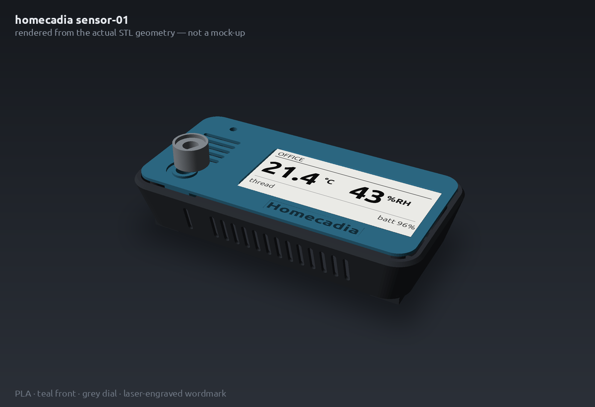
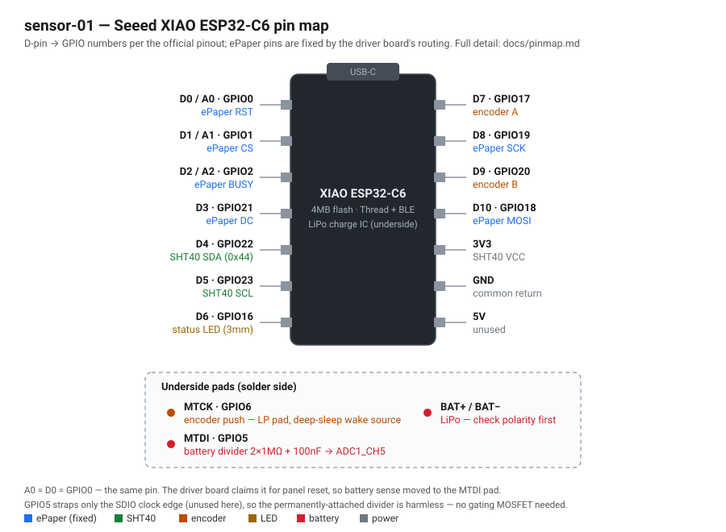

# homecadia

Home-built smart home devices for Home Assistant, Matter over Thread.

[](https://github.com/vavallee/homecadia/actions/workflows/build-sensor-01.yml)

<!-- photo goes here once a unit is assembled:  -->

> **Status: pre-assembly.** The firmware builds in CI and has been flashed and
> booted on a bare XIAO ESP32-C6 (no sensor, no panel, no battery). Nothing in
> this repo has yet run on a fully assembled unit — commissioning, display
> output, encoder direction, ADC calibration, and every current figure are
> unverified. Code written ahead of the hardware is marked `HW-VERIFY` in
> source and tracked in [docs/bringup.md](docs/bringup.md). Treat this as a
> build log you can read, not a design you should reproduce unmodified.

## Devices

| Device | Status | Description |
|---|---|---|
| [sensor-01](firmware/sensor-01/) | in development | Battery-powered room temp/humidity sensor. 2.9" e-ink display, rotary dial, Matter-over-Thread sleepy end device (LIT ICD). 3 units. |

## Features

Firmware capabilities, all implemented in this repo unless noted:

- **Matter over Thread**, Wi-Fi compiled out. OpenThread MTD, commissioned over
  Bluetooth Low Energy, joins via any OpenThread border router (developed
  against Home Assistant Connect ZBT-2).
- **Long Idle Time ICD** (Intermittently Connected Device) so the node sleeps
  between subscription reports instead of polling continuously.
- **Matter clusters**: TemperatureMeasurement, RelativeHumidityMeasurement, and
  PowerSource with battery percentage and voltage.
- **Delta-gated reporting** — a report is sent on ≥0.2 °C / ≥1 %RH change, with
  a forced heartbeat every N polls, instead of on every sample.
- **SHT40 driver** (`firmware/components/sht40`) on the ESP-IDF 5.x
  `i2c_master` API, high-precision single-shot with Sensirion CRC-8 checking.
- **SSD1680 e-paper driver** (`firmware/components/ssd1680`) with differential
  partial refresh, periodic full refresh for ghosting, and panel deep sleep
  between updates.
- **1-bit framebuffer renderer** (`firmware/components/monogfx`) with a scaled
  5×7 font and a seven-segment digit routine — no external graphics library.
- **EC11 rotary encoder** (`firmware/components/ec11_encoder`) decoded from a
  Gray-code transition table in an interrupt handler: bounce-immune and drawing
  no idle current.
- **Local-only UI**: readings, diagnostics, and settings views; settings persist
  in NVS. The display never renders Home Assistant state — it shows what this
  device measured.
- **Battery monitoring** via a 2×1 MΩ + 100 nF divider on GPIO5, one-shot ADC
  with curve-fitting calibration and an open-circuit-voltage lookup table.
- **Factory reset** on a 10-second encoder press; commissioning and low-battery
  states shown on a single LED and on the display.
- **CI** builds the flashable images on every push touching `firmware/**` and
  uploads them as an artifact.

## sensor-01 hardware

Seeed XIAO ESP32-C6 + Seeed ePaper Driver Board for XIAO V2 + 2.9" mono e-ink
(296×128, SSD1680) + Grove SHT40 + EC11 rotary encoder + 2000mAh LiPo, in a
wall-mount enclosure remixed from [veltoc](https://github.com/danking6/veltoc)
([hardware/case](hardware/case/README.md) — rev 4, FDM PLA, laser-engraved
wordmark).



*Assembled view rendered from the enclosure STLs. Colours and finish are
indicative; no unit has been built yet.*



Full bill of materials: [docs/bom.md](docs/bom.md). Pin map with the
schematic-verified board facts behind this diagram:
[docs/pinmap.md](docs/pinmap.md). The official bare-board pinout is on the
[Seeed XIAO ESP32-C6 wiki](https://wiki.seeedstudio.com/xiao_esp32c6_getting_started/)
(not reproduced here — Seeed's wiki content is GPL-3.0, this repo is MIT).

⚠️ This build involves a bare lithium-polymer cell soldered directly to the
board. Read the polarity warning at the top of
[docs/assembly.md](docs/assembly.md) before connecting anything — reversed
polarity destroys the charge circuit, and damaged LiPo cells are a fire hazard.

## Firmware

Espressif [esp-matter](https://github.com/espressif/esp-matter) v1.6 on
ESP-IDF v5.5.5, C++. Thread only (Wi-Fi disabled), commissions over Bluetooth
Low Energy to Home Assistant via an OpenThread border router (Home Assistant
Connect ZBT-2). Build instructions: [docs/build.md](docs/build.md).

The device advertises Espressif's **test vendor ID 0xFFF1** and shared test
commissioning credentials. It is not a Matter-certified product; controllers
will show an uncertified-device warning. Per-device factory partitions
(`esp-matter-mfg-tool`) are an open work item — see
[docs/commissioning.md](docs/commissioning.md).

## Documentation

| Doc | Contents |
|---|---|
| [docs/bom.md](docs/bom.md) | Bill of materials, part SKUs, divider-value rationale |
| [docs/pinmap.md](docs/pinmap.md) | Pin assignments and schematic-verified XIAO ESP32-C6 board facts |
| [docs/assembly.md](docs/assembly.md) | Wiring and build order, battery-polarity warning |
| [docs/build.md](docs/build.md) | Pinned toolchain SHAs, Docker and native builds, flashing from WSL2 |
| [docs/commissioning.md](docs/commissioning.md) | Pairing to Home Assistant or Apple Home, Matter server setup, factory reset |
| [docs/power-budget.md](docs/power-budget.md) | Modeled current draw, battery-life calculator, the policies it forced |
| [docs/bringup.md](docs/bringup.md) | Hardware verification checklist — every `HW-VERIFY` marker has a row |
| [docs/infrastructure.md](docs/infrastructure.md) | Network-side hardware: ZBT-2 border router, Voice PE, order status |
| [docs/source-reliability.md](docs/source-reliability.md) | Documented traps in vendor docs and third-party sources |
| [hardware/case/README.md](hardware/case/README.md) | Enclosure: revision history, measured wall thicknesses, print vendor and material, engraving artwork |

## Milestones

| # | Deliverable | Status |
|---|---|---|
| 1 | Repo scaffold, docs, CI compiling an esp-matter skeleton for esp32c6 | done |
| 2 | Matter temp/humidity over Thread, commissions to HA (TinyENV parity) | code complete; commissioning test awaits hardware |
| 3 | Display driver, view 1 rendering readings, measured refresh cost | code complete; refresh cost measurement awaits hardware |
| 4 | Encoder, views, settings, wake behavior | code complete; encoder direction + wake await hardware |
| 5 | ICD tuning, battery reporting, power budget with measured numbers | LIT ICD configured; tuning + measurements await hardware |
| 6 | Factory reset, low-battery behavior, assembly guide final, v1.0.0 | factory reset + LED + low-bat display done; rest awaits hardware |

## Repo layout

```
docs/               BOM, pin map, assembly, commissioning, power budget, build
hardware/case/      wall-mount enclosure (veltoc remix, MIT)
firmware/
  components/       drivers shared across future homecadia devices
  sensor-01/        esp-matter application
.github/workflows/  CI: firmware build on push, .bin artifacts
```

## Contributing

This is a personal build, developed against one specific parts list. Issues and
pull requests are welcome, but the parts list, the pinned toolchain, and the
locked design decisions in the docs are unlikely to change. If you fork it for
different hardware, `firmware/sensor-01/main/app_config.h` is the single source
of pin truth and the place to start.

## License

MIT, see [LICENSE](LICENSE). Third-party attribution — including the veltoc
enclosure remix and the TinyENV architecture references — is in
[NOTICE.md](NOTICE.md).
