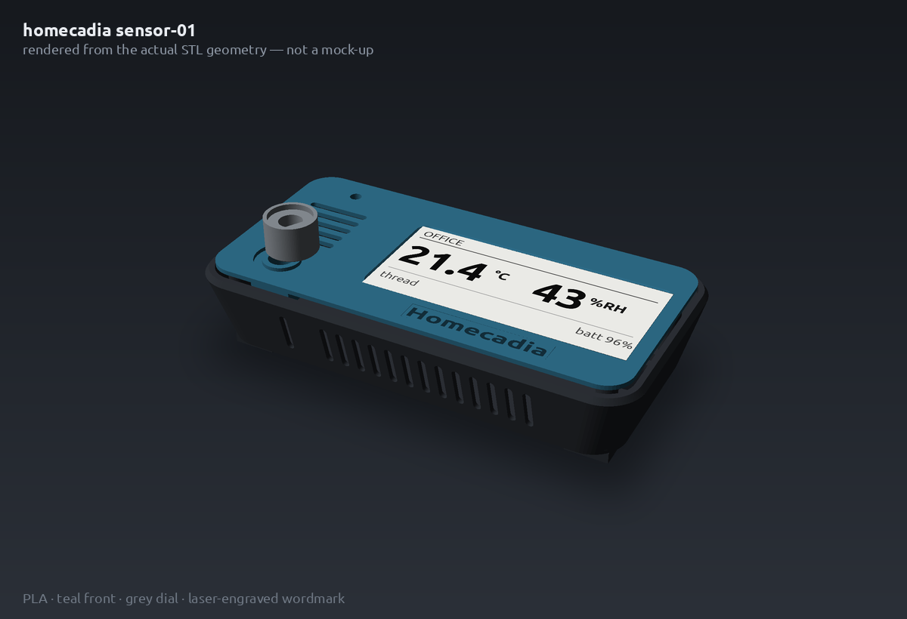
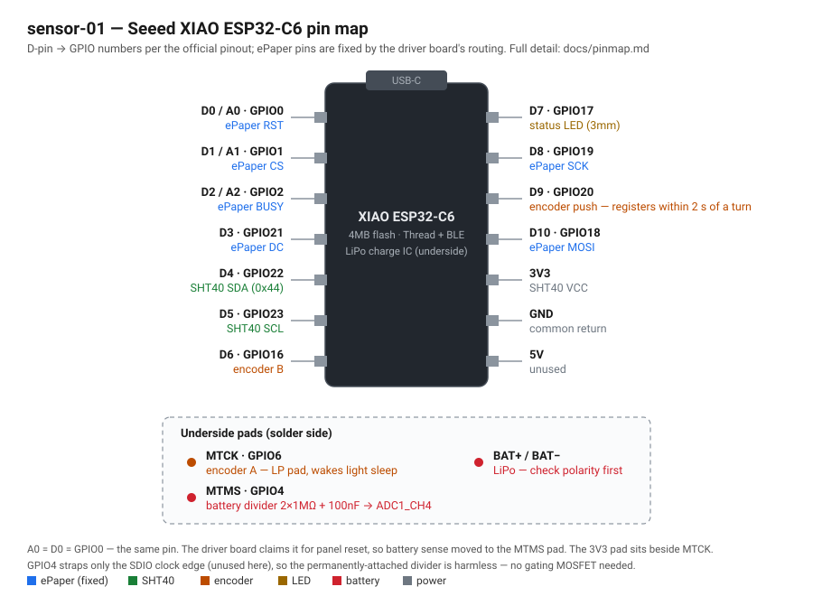

# homecadia

**Battery-powered Matter-over-Thread room sensors for Home Assistant, with an
e-ink display and a rotary dial. Built from scratch on the ESP32-C6.**

[](https://github.com/vavallee/homecadia/actions/workflows/build-sensor-01.yml)
[](LICENSE)
[](docs/build.md)
[](docs/build.md)



<!-- photo replaces the render once a unit is assembled:  -->

A room temperature and humidity sensor that reports to Home Assistant over
Thread, shows its own readings on a 2.9" e-ink panel, takes input from a rotary
dial, and averages 185 µA measured on the bench — about twelve months on one
2000 mAh cell at 85 % usable. No vendor cloud, no hub beyond a Thread border
router, and no Wi-Fi — the radio is compiled out.

Everything is here: firmware, drivers, pin map with schematic-verified board
facts, power budget, 3D-printable enclosure, bill of materials with real prices,
and the reasoning behind each decision.

> **Status: bench-verified, not yet assembled.** One unit runs on the bench
> (XIAO, driver board, panel, SHT40, encoder on a breadboard) with a Nordic PPK2
> standing in for the cell. Verified there: commissioning to Home Assistant over
> Thread, display output, battery-voltage reading (within 3 mV of a meter,
> 3.4–4.0 V), current — 238 µA average over a 12.6 h soak (2026-09-17),
> 185 µA settled on the short-idle-time build (2026-10-05) — and the dial waking the chip from light sleep on battery power
> (2026-09-28). It has since run 21 h on a real LiPo with no restart
> (2026-09-29). **Not yet done:** a long battery soak, and the enclosure, which
> is being redesigned. Open rows are in [docs/bringup.md](docs/bringup.md). Code written
> ahead of hardware is marked `HW-VERIFY` and tracked there. The build
> procedure, with a test gate after every soldering stage, is
> [docs/assembly.md](docs/assembly.md).

## Devices

| Device | Status | Description |
|---|---|---|
| [sensor-01](firmware/sensor-01/) | in development | Battery-powered room temp/humidity sensor. 2.9" e-ink display, rotary dial, Matter-over-Thread sleepy end device (SIT ICD). 3 units. |

## What you can lift from here

The drivers are self-contained ESP-IDF components with no dependencies beyond
the IDF itself. Copy the directory into your own `components/` and it builds.
MIT licensed.

| Component | Why it might be useful |
|---|---|
| [`sht40`](firmware/components/sht40) | Sensirion SHT40 on the ESP-IDF 5.x `i2c_master` API (not the deprecated legacy driver), high-precision single-shot with CRC-8 validation |
| [`ssd1680`](firmware/components/ssd1680) | 2.9" e-paper with **differential partial refresh**, periodic full refresh to clear ghosting, and panel deep sleep between updates — the parts most sample code leaves out |
| [`monogfx`](firmware/components/monogfx) | 1-bit framebuffer renderer with a scaled 5×7 font and a seven-segment digit routine. No LVGL, no external graphics library |
| [`ec11_encoder`](firmware/components/ec11_encoder) | EC11 rotary encoder decoded from a Gray-code transition table in an ISR — bounce-immune without debounce delays, and draws no idle current |

Also reusable regardless of hardware: the
[power budget](docs/power-budget.md) and the firmware policies it forced, and
the [documented traps](#traps-that-cost-time) below.

## Features

Firmware capabilities, all implemented in this repo unless noted:

- **Matter over Thread**, Wi-Fi compiled out. OpenThread MTD, commissioned over
  Bluetooth Low Energy, joins via any OpenThread border router (developed
  against Home Assistant Connect ZBT-2).
- **Long Idle Time ICD** (Intermittently Connected Device) so the node sleeps
  between subscription reports instead of polling continuously. Configured for
  a 30 s slow poll; until a controller registers as an ICD client the stack runs
  short-idle mode and clamps it to 15 s, which is what Home Assistant gets today.
- **Matter clusters**: TemperatureMeasurement, RelativeHumidityMeasurement, and
  PowerSource with battery percentage and voltage.
- **Delta-gated reporting** — a report is sent on ≥0.2 °C / ≥1 %RH change, with
  a forced heartbeat every N polls, instead of on every sample.
- **SHT40 driver** (`firmware/components/sht40`) on the ESP-IDF 5.x
  `i2c_master` API, high-precision single-shot with Sensirion CRC-8 checking.
- **SSD1680 e-paper driver** (`firmware/components/ssd1680`) with differential
  partial refresh, periodic full refresh for ghosting, and panel deep sleep
  between updates.
- **1-bit framebuffer renderer** (`firmware/components/monogfx`) with a scaled
  5×7 font and a seven-segment digit routine — no external graphics library.
- **EC11 rotary encoder** (`firmware/components/ec11_encoder`) decoded from a
  Gray-code transition table in an interrupt handler: bounce-immune and drawing
  no idle current.
- **Local-only UI**: readings, diagnostics, and settings views; settings persist
  in NVS. The display never renders Home Assistant state — it shows what this
  device measured.
- **Battery monitoring** via a 2×1 MΩ + 100 nF divider on GPIO4 (an underside
  pad): 64 one-shot ADC samples after a 20 ms settle, eFuse curve-fitting
  calibration, and a scale factor fitted against a metered source to correct the
  ADC input loading the 500 kΩ divider. Open-circuit-voltage lookup table for
  percent.
- **Factory reset** on a 10-second encoder press (turn first: the switch is on
  a pin that cannot wake the chip); commissioning and low-battery states shown
  on a single LED and on the display.
- **CI** builds the flashable images on every push touching `firmware/**` and
  uploads them as an artifact.

## sensor-01 hardware

Seeed XIAO ESP32-C6 + Seeed ePaper Driver Board for XIAO V2 + 2.9" mono e-ink
(296×128, SSD1680) + Grove SHT40 + EC11 rotary encoder + 2000mAh LiPo, in a
wall-mount enclosure remixed from [veltoc](https://github.com/danking6/veltoc)
([hardware/case](hardware/case/README.md) — rev 4, FDM PLA, laser-engraved
wordmark).


*Assembled view rendered from the enclosure STLs. Colours and finish are
indicative; no unit has been built yet.*



Full bill of materials: [docs/bom.md](docs/bom.md). Pin map with the
schematic-verified board facts behind this diagram:
[docs/pinmap.md](docs/pinmap.md). The official bare-board pinout is on the
[Seeed XIAO ESP32-C6 wiki](https://wiki.seeedstudio.com/xiao_esp32c6_getting_started/)
(not reproduced here — Seeed's wiki content is GPL-3.0, this repo is MIT).

⚠️ This build involves a bare lithium-polymer cell soldered directly to the
board. Read the polarity warning at the top of
[docs/assembly.md](docs/assembly.md) before connecting anything — reversed
polarity destroys the charge circuit, and damaged LiPo cells are a fire hazard.

## Firmware

Espressif [esp-matter](https://github.com/espressif/esp-matter) v1.6 on
ESP-IDF v5.5.5, C++. Thread only (Wi-Fi disabled), commissions over Bluetooth
Low Energy to Home Assistant via an OpenThread border router (Home Assistant
Connect ZBT-2). Build instructions: [docs/build.md](docs/build.md).

The device advertises Espressif's **test vendor ID 0xFFF1** and shared test
commissioning credentials. It is not a Matter-certified product; controllers
will show an uncertified-device warning. Per-device factory partitions
(`esp-matter-mfg-tool`) are an open work item — see
[docs/commissioning.md](docs/commissioning.md).

## Documentation

| Doc | Contents |
|---|---|
| [docs/bom.md](docs/bom.md) | Bill of materials, part SKUs, divider-value rationale |
| [docs/pinmap.md](docs/pinmap.md) | Pin assignments and schematic-verified XIAO ESP32-C6 board facts |
| [docs/assembly.md](docs/assembly.md) | Wiring and build order, battery-polarity warning |
| [docs/build.md](docs/build.md) | Pinned toolchain SHAs, Docker and native builds, flashing from WSL2 |
| [docs/commissioning.md](docs/commissioning.md) | Pairing to Home Assistant: the three preconditions, the BLE-proxy workaround, factory reset. Apple Home is not available here and the doc says why |
| [docs/field-notes.md](docs/field-notes.md) | **Traps that cost real time during bring-up**, ordered by cost. Read before bringing up another unit |
| [docs/power-budget.md](docs/power-budget.md) | Modeled current draw, battery-life calculator, the policies it forced |
| [docs/battery-runbook.md](docs/battery-runbook.md) | Why a pack reads 0 V or a unit resets on battery: protection-board causes, look-alikes, and the test order |
| [docs/bringup.md](docs/bringup.md) | Hardware verification checklist — every `HW-VERIFY` marker has a row |
| [docs/diagrams/](docs/diagrams/) | Bench wiring, battery/divider schematic, enclosure internals and the no-solder bring-up ladder (self-contained HTML) |
| [docs/infrastructure.md](docs/infrastructure.md) | Network-side hardware: ZBT-2 border router, Thread coverage, Voice PE, order status |
| [docs/source-reliability.md](docs/source-reliability.md) | Documented traps in vendor docs and third-party sources |
| [hardware/case/README.md](hardware/case/README.md) | Enclosure: revision history, measured wall thicknesses, print vendor and material, engraving artwork |
| [circuit-board-maker/](circuit-board-maker/README.md) | Custom-PCB evaluation and two paper board designs. **Concluded: not worth it for three units.** Never fabricated — see the conflicts list before reviving it |

## Traps that cost time

Findings that aren't in any datasheet, written down so the next person doesn't
pay for them twice. Full list in
[docs/source-reliability.md](docs/source-reliability.md) and
[docs/pinmap.md](docs/pinmap.md).

- **A0 and D0 are the same pin on the XIAO ESP32-C6.** If your display uses D0
  for reset, the obvious ADC pin is gone. Battery sense moved to an underside
  test pad ([pinmap](docs/pinmap.md)).
- **The C6's RF switch is off at reset.** GPIO3 has a 10k pull-up and must be
  driven low in firmware before the antenna works; GPIO14 selects onboard
  ceramic versus U.FL. Neither pin is on the header. Schematic-verified.
- **espboards.dev pin tables are wrong for the C6** — they're shared boilerplate
  across ESP32 variants.
- **The Seeed wiki's battery-sense snippet doesn't apply.** It assumes an
  onboard divider the C6 schematic shows isn't populated.
- **A 100k battery divider costs ~9% of a 300µA budget.** 2×1MΩ + 100nF instead,
  at the price of a high-impedance ADC source ([power budget](docs/power-budget.md)).
- **A live ADC unit keeps the C6's radio power domain on through every light
  sleep** (~95 µA). Create and delete the unit per reading, and hold a
  no-light-sleep lock across it or the chip can fail to wake
  ([field notes](docs/field-notes.md) §21).
- **The chip only powers down its peripherals in light sleep if every I2C and
  SPI bus asks for it** (`flags.allow_pd`, `SPICOMMON_BUSFLAG_SLP_ALLOW_PD`).
  Without them the sleep floor was 279 µA; with them, 56 µA (§21).
- **A multimeter on a high-impedance node is a load, not a reference.** A 10 MΩ
  meter reads a 1 MΩ:1 MΩ divider midpoint ~5 % low. Calibrate the ADC against
  the supply, end to end (§23).
- **Light sleep kills the USB serial port in ~2 seconds**, which makes a board
  effectively unflashable without `CONFIG_USJ_NO_AUTO_LS_ON_CONNECTION`
  ([build](docs/build.md) has the recovery procedure, including the WSL2/usbipd
  quirks).
- **Opening `/dev/ttyACM0` with a plain shell read can hard-reset the chip** —
  it pulses the USB-Serial-JTAG control lines. Use `idf.py monitor`.
- **Seeed's sleep-current figures are for a bare board.** Measured on this build:
  a 52–59 µA light-sleep floor once the two fixes above were in; 376 µA before
  them ([power budget](docs/power-budget.md)).

## Milestones

| # | Deliverable | Status |
|---|---|---|
| 1 | Repo scaffold, docs, CI compiling an esp-matter skeleton for esp32c6 | done |
| 2 | Matter temp/humidity over Thread, commissions to HA (TinyENV parity) | **done 2026-08-23** — commissioned to HA over ZBT-2 OTBR, readings live in HA; see `docs/field-notes.md` for the preconditions |
| 3 | Display driver, view 1 rendering readings, measured refresh cost | display verified on hardware 2026-08-22 (full 1.79s / partial 0.54s BUSY); refresh charge cost still unmeasured |
| 4 | Encoder, views, settings, wake behavior | **done 2026-09-28** — a detent wakes the chip from light sleep on battery (encoder A on the MTCK pad); the push switch registers within 2 s of a turn |
| 5 | ICD tuning, battery reporting, power budget with measured numbers | **done 2026-09-22** — 238 µA average over 12.6 h (budget ≤300 µA), battery voltage within 3 mV; see `docs/power-budget.md` |
| 6 | Factory reset, low-battery behavior, assembly guide final, v1.0.0 | factory reset + LED + low-bat display done; rest awaits hardware |

## Repo layout

```
docs/               BOM, pin map, assembly, commissioning, power budget, build
hardware/case/      wall-mount enclosure (veltoc remix, MIT) + engraving artwork
circuit-board-maker/ custom-PCB evaluation + two unfabricated KiCad designs
firmware/
  components/       drivers shared across future homecadia devices
  sensor-01/        esp-matter application
.github/workflows/  CI: firmware build on push, .bin artifacts
```

## Building it yourself

1. **Read [docs/bom.md](docs/bom.md)** — real parts, real prices in CAD, real
   vendors, and which ones have known counterfeits or reversed polarity.
2. **Print the enclosure** from [hardware/case](hardware/case/README.md), or
   adapt it. The revision history there explains why each dimension is what it
   is, which matters if you swap the battery or the display.
3. **Build the firmware** with [docs/build.md](docs/build.md) — Docker path
   matches CI exactly and is the low-friction option.
4. **Wire it** using [docs/pinmap.md](docs/pinmap.md) and
   [docs/assembly.md](docs/assembly.md). Read the LiPo polarity warning first.
5. **Commission it** with [docs/commissioning.md](docs/commissioning.md), then
   work through [docs/bringup.md](docs/bringup.md).

Forking for different hardware? `firmware/sensor-01/main/app_config.h` is the
single source of pin truth and the place to start.

## Contributing

This is a personal build against one specific parts list, so the parts list, the
pinned toolchain and the locked design decisions are unlikely to change. That
said: **corrections are very welcome**, especially if you've measured something
this repo only models, or if one of the [traps](#traps-that-cost-time) turns out
to be wrong on your hardware. Issues and pull requests both fine.

## License

MIT, see [LICENSE](LICENSE). Third-party attribution — including the veltoc
enclosure remix and the TinyENV architecture references — is in
[NOTICE.md](NOTICE.md).
