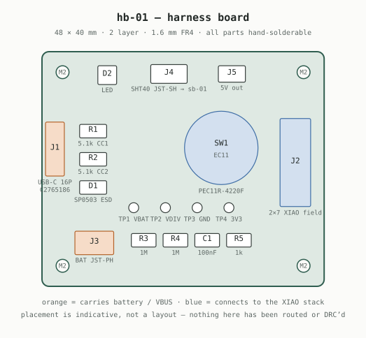
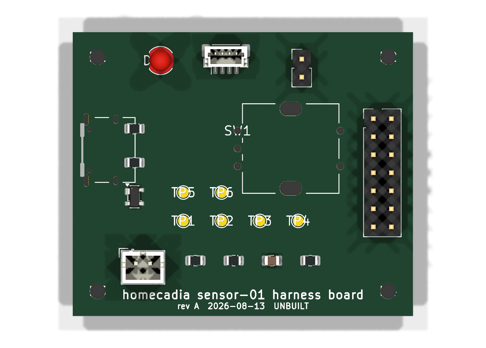
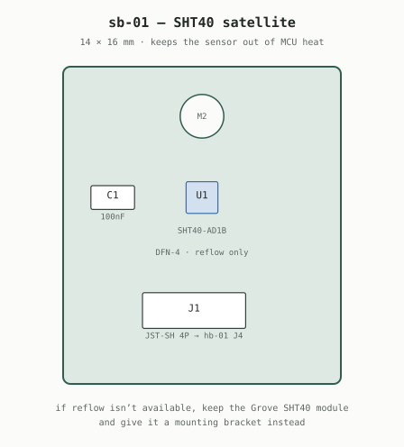
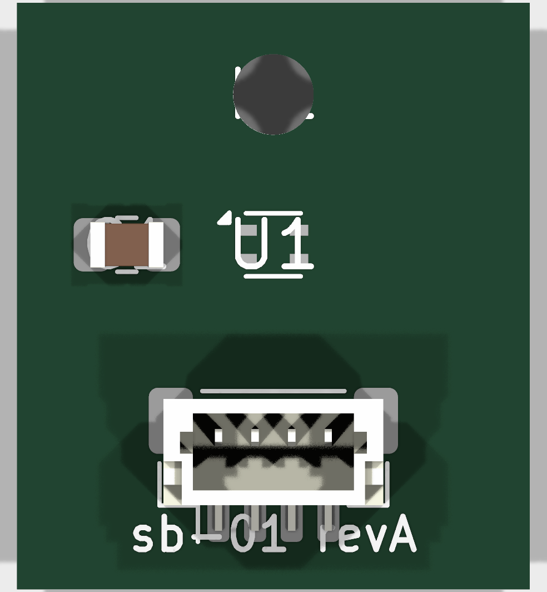
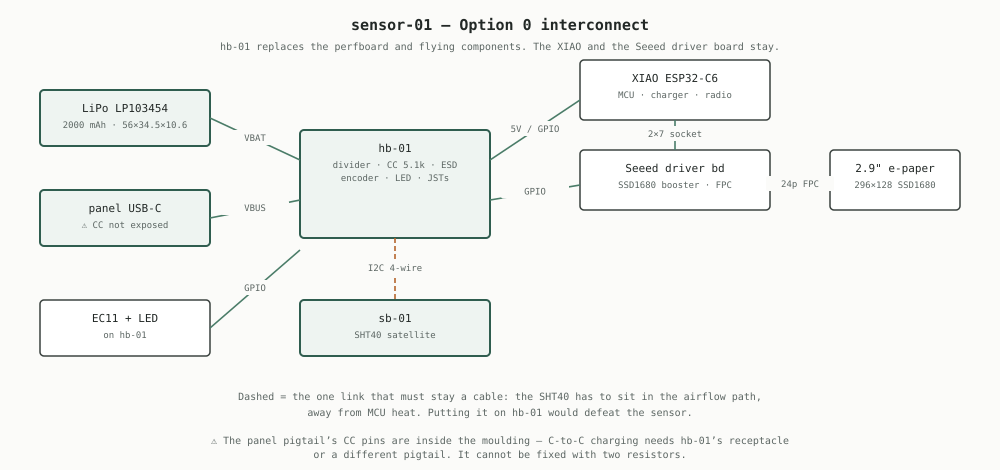

# circuit-board-maker

Investigation into replacing the hand-wired sensor-01 build with a custom PCB,
and the board designs that came out of it.

> **Status: paper design, validated against KiCad 10.0.5 but never fabricated.**
> See [Validation](#validation) for exactly what was checked and what was not.

## Conclusion

**Don't build a full custom PCB for three units.** Build `hb-01`, hand-wire the
three units, and measure the assembled device before letting any power argument
justify a board spin. Full reasoning in [pcb-evaluation.md](pcb-evaluation.md).

## Documents

| Doc | Contents |
|---|---|
| [pcb-evaluation.md](pcb-evaluation.md) | Three options costed, quiescent-current budgets, antenna clearance, firmware change surface, and why a PCB doesn't earn its cost at qty 3 |
| [component-selection.md](component-selection.md) | Board-mount part equivalents with live LCSC stock, and the three parts where board-mounting is a downgrade |

## Boards

| Board | Size | Purpose | Assembly | DRC |
|---|---|---|---|---|
| [hb-01/](hb-01/) | 48 × 40 mm | Harness board — divider, USB-C + CC resistors, ESD, encoder, LED, JSTs, 6 test points | **Hand-solderable** | 65 errors, all inside J1 — see below |
| [sb-01/](sb-01/) | 14 × 16 mm | SHT40 satellite, keeps the sensor out of MCU heat | Needs reflow or hot air | **0 errors** |

### hb-01





### sb-01





### How they connect



## Files per board

```
hb-01/
  hb-01.kicad_pro    project settings, net classes
  hb-01.kicad_pcb    board outline, mounting holes, silkscreen, 24 placed footprints with nets
  hb-01.net          KiCad netlist
  NETLIST.md         authoritative connection list + BOM with LCSC codes
```

There is no `.kicad_sch`. The netlist is the design; a schematic is a drawing of
it, and KiCad can generate one from the board. Open the `.kicad_pro`, and the
footprints are already placed with nets assigned — start by routing.

## Validation

Run against **KiCad 10.0.5** (Windows install, driven from WSL via
`kicad-cli.exe`). What that actually established:

**Verified:**

- **All 13 footprint library references resolve** against KiCad 10's installed
  libraries. One was wrong on the first pass and is fixed —
  `Sensirion_DFN-4-1EP_1.5x1.5mm_P0.8mm_EP0.7x0.9mm` does not exist; the real
  name is `Sensirion_DFN-4_1.5x1.5mm_P0.8mm_SHT4x_NoCentralPad`.
- **`kicad-cli pcb upgrade` accepted both boards** and rewrote them in the
  current format — KiCad parses them.
- **All 26 footprints place with nets assigned**, 0 missing.
- **J1's pads are byte-identical to the library footprint** after the
  generate-and-place round trip (17 pads compared, 0 differences).
- **Both boards render in 3D** — the images above are `kicad-cli pcb render`
  output, not drawings.
- **sb-01 passes DRC with 0 errors.**
- Encoder terminal geometry **checked against the Bourns PEC11R datasheet**:
  5 × Ø1.0 mm holes, 2.5 mm pitch, 5.0 mm spans — matches the footprint.

**Found and fixed during validation:**

- USB-C on hb-01 and the JST-SH on sb-01 both **hung off the board edge**.
- sb-01's C1 and J1 **collided** (courtyard overlap + clearance error).
- sb-01's silkscreen **overflowed a 12 × 16 mm board**; it is now 14 × 16 mm
  with a shorter silk string.
- D+/D− were documented as "broken out to test pads" but **were never actually
  netted**. They now go to TP5/TP6.

**Not resolved:**

- **hb-01 reports 65 DRC errors, every one of them inside J1** (the USB-C
  receptacle) and zero anywhere else. The XKB U262-16XN land pattern has 0.2 mm
  pad gaps, and `kicad-cli` runs with KiCad's default 0.2 mm clearance because
  this hand-written `.kicad_pro` is too minimal for it to load design rules
  from — setting the netclass to 0.05 mm changed nothing. **Open the project in
  the GUI once, set Board Setup → Constraints to 0.127 mm, and save.** That is
  the boundary where these generator scripts should stop and KiCad takes over.
- **Silkscreen sits over pads** on both boards (`silk_over_copper` warnings).
  On sb-01 this hides U1's 0.5 × 0.3 mm pads in the render — they are present
  and netted, just buried under the reference designator.
- **Nothing is routed.** hb-01 has 37 unconnected items, sb-01 has 6.
- **Board dimensions are not fitted to the case.** 48 × 40 mm was chosen to sit
  beside the LP103454 in the 106.64 × 47.9 mm cavity, but was never checked
  against the STLs in [hardware/case](../hardware/case/).
- **The Seeed driver board's IO breakout pinout is undocumented.** `J2` is a
  labelled 2.54 mm field, not a verified mating connector. Probe it when the
  board arrives.
- **The encoder's mounting-boss holes are unverified.** `PEC12R-3x17F-Sxxxx` is
  used because no PEC11R footprint ships with KiCad; its terminals match, but it
  drills 3.1 mm oval bosses and the PEC11R boss dimension could not be read
  reliably from the datasheet drawing. Check before ordering.
- **USB-C on hb-01 carries power only.** The XIAO does not expose D+/D− on its
  header, so flashing and console stay on the XIAO's own connector. TP5/TP6 are
  there for probing, not for a host connection.

## Regenerating

```
python3 gen.py      # netlists, .kicad_pcb outline, .kicad_pro, NETLIST.md
python3 place.py    # loads footprints from the KiCad libs and places them
python3 svg.py      # img/*.svg
```

`place.py` reads the KiCad footprint libraries from
`/mnt/c/Program Files/KiCad/10.0/share/kicad/footprints` — adjust that path
elsewhere. Edit the spec at the top of `gen.py` rather than the generated files.

Once the design moves into KiCad's GUI, **KiCad owns these files** and these
scripts should be retired — re-running them discards routing.
