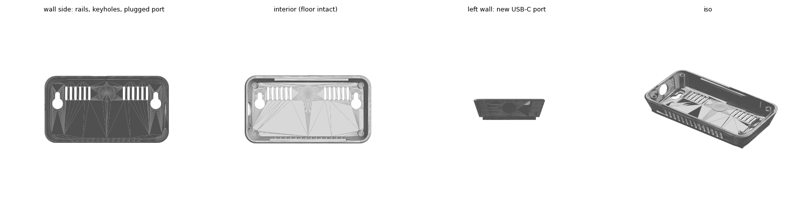

# Wall-mount case (veltoc remix, rev 2)

Remix of [veltoc](https://github.com/danking6/veltoc) 3D models (MIT,
© 2026 Dan King). `case-back-wallmount.stl` and `case-front.stl` are both
modified; `insert-tray.stl` and `encoder-knob.stl` print as-is from upstream.

> **rev 2 — lengthened 7 mm for the 2000 mAh cell.** Upstream is built around a
> 1400 mAh cell (EEMB 112945, 45 mm long). Our BOM specifies a 2000 mAh EEMB
> LP103454, whose finished size is **56 × 34.5 × 10.6 mm** — 11 mm longer. The
> rev 1 interior measured 99.64 mm and had to hold the 48.5 mm `insert-tray`
> plus the cell: 104.5 mm of parts in a 99.6 mm box.
>
> Both shells were cut at **x = 24.73 mm** — a band verified prismatic (identical
> cross-section either side) and clear of the display aperture (29.5–97.5),
> encoder, LED, vents and tray posts — and everything right of the cut moved
> +7 mm. Interior is now **106.64 mm**, leaving **2.1 mm clearance**. The display
> aperture is unchanged at 68.00 mm wide; it simply sits 7 mm further along.

## Files (`stl/`)

| File | Status | Outer size (mm) | Notes |
|---|---|---|---|
| case-back-wallmount.stl | remixed + rev 2 stretch | 116.28 × 59.28 × 23.00 | wall-mount rails, side USB-C, rear port plugged |
| case-front.stl | rev 2 stretch | 110.60 × 53.60 × 8.20 | EC11 mount (Ø6.8 shaft hole, Ø9.8/Ø14 recess), 3mm LED hole, display aperture |
| insert-tray.stl | rev 2 thickened | 48.50 × 45.50 × 6.60 | XIAO mount: plate thickened 1.0 → **1.6mm**, four Ø2.4mm pegs on a 17.0 × 21.0mm pattern. **Not** a battery cradle — the cell sits loose beside it |
| encoder-knob.stl | upstream | 13.50 × 13.50 × 9.50 | fits 20mm flatted D-shaft |

Interior of the assembled back: **106.64 × ~47.9 × ~18.6 mm**, one open cavity
with four corner bosses. No battery compartment and no sensor mount — both are
open questions for the test fit.

## Changes in case-back-wallmount.stl

- Rear Ø12.8mm panel-mount USB-C hole **plugged** (was center-rear — would
  face the wall).
- New Ø12.8mm USB-C hole through the **left side wall** (y=25, z=10) for the
  female USB-C panel pigtail; cable reaches the XIAO's USB-C internally.
- Two standoff rails (11×44×3mm) on the rear face: 3mm air gap so the rear
  vents breathe against a wall, and flat landings for Command Small strips
  (one per rail).
- Keyhole slots in each rail (**92mm apart after the rev 2 stretch** — was 85;
  measured centre-to-centre at x=7.50 and x=99.50, center height y=30): Ø9.5 entry,
  4.3mm slot rising 8mm, head pocket behind a 2mm retention face. Fits #6
  pan-head screws (head ≤ Ø8.5×2.4mm). Level the two screws; the slot rises
  up, so the case drops onto them.
- Orientation on the wall: slatted side **down** (air inlet), rear vent band
  at the top (outlet).

## Wall thickness / DFM

Measured off the meshes, so these are the numbers to answer a vendor DFM flag with:

| Feature | Thickness | Verdict |
|---|---|---|
| `case-back-wallmount` shell walls | **1.44mm** | 3–4 perimeters at a 0.4mm nozzle — normal enclosure wall in PETG |
| `case-front` shell walls | **~1.3mm** | same |
| `insert-tray` plate | **1.60mm** (rev 2; was 1.00) | thickened specifically to clear the flag |
| `insert-tray` pegs | Ø2.4mm shank, Ø4.0mm base, 5mm tall | pins, not walls; printable in PETG |

JLC3DP's FDM guidance is a 1.2mm minimum with 2mm ideal, so the shells sit
between the two and trigger "thin walls detected". **Accept it** — 1.4mm PETG
is a sound enclosure wall, and thickening the shells would mean a true surface
offset in CAD, not the cut-and-shift edits used here.

Sub-millimetre readings do appear in an automated scan (down to 0.13mm) at the
corner bosses and the mating lip. Those are **tangency slivers** where a
cylindrical boss meets a filleted wall, not standalone walls; slicers merge
them into the adjacent perimeter. Verified by cross-section at z=10.

**Material: FDM ABS** (ASA if a unit will sit in direct sun — same properties
plus UV stability). **JLC3DP does not offer PETG**: their FDM lineup is ABS,
ASA, PA12-CF, TPU, PEBA, PEEK, ABS-ESD and PLA-P. ABS is the closest match —
98 °C heat deflection, tough, and safe around a LiPo in a way PLA (softens
~60 °C) is not. Avoid resin (SLA): brittle, UV-degrading, and it would shear
the Ø2.4mm tray pegs and the M2 self-tapper bosses.

### JLC3DP FDM minimum part size — blocks three of the four parts

Their FDM process enforces a **30 × 30 × 10 mm minimum bounding box**. Measured
against it:

| Part | Size (mm) | Passes? |
|---|---|---|
| case-back-wallmount | 116.28 × 59.28 × 23.00 | yes |
| case-front | 110.60 × 53.60 × **8.20** | **no** — 1.8mm under on thickness |
| insert-tray | 48.50 × 45.50 × **6.60** | **no** — 3.4mm under |
| encoder-knob | 13.50 × 13.50 × **9.50** | **no** — under on all three |

Confirmed by the vendor for `encoder-knob.stl`; the other two are the same rule
applied to measured dimensions and need confirming in the quoting UI. If the
front and tray are also rejected, JLC3DP FDM cannot print this case and the
options are another service (most have no such minimum), their SLA process for
the flat parts, or a local printer.

The knob is not worth solving: a **6mm D-shaft EC11 knob** is a commodity part
(aluminium ones ~19mm diameter are common). Buy one per unit and drop
`encoder-knob.stl` from the print order.

## Print notes

- 3 units → print each file ×3. PETG or PLA, ~0.2mm layers.
- Back prints rear-face down (rails on bed); keyhole head-pockets bridge
  ~8.8mm — fine with standard supports/bridging.
- Tolerances derived from published dims, **not test-fitted**. Print ONE unit
  first and test-fit the panel, driver board, encoder, USB pigtail and a #6
  screw head before committing all three.
- `case-back-wallmount.stl` carries **33 non-manifold edges** — present in the
  upstream mesh, not introduced by the rev 2 stretch (verified against git
  HEAD). Slicers and JLC3DP auto-repair this class of defect; no action needed
  unless a slicer complains.
- `preview.png` still shows the rev 1 geometry and is **stale** — regenerate it
  once a unit is assembled.

## Parts this design needs beyond the sensor BOM

- EC11-style rotary encoder (upstream links Amazon B08728K3YB; this build
  uses the Bourns PEC11R — see [docs/bom.md](../../docs/bom.md))
- Female USB-C panel-mount pigtail (upstream links Amazon B0D1MW6YPL; bezel
  must fit Ø12.8)
- 3mm LED
- Battery divider resistors: upstream specifies 2×100k, **this build uses
  2×1MΩ + 100nF** — 100k bleeds ~21µA continuously, ~9% of the power budget
  ([docs/bom.md](../../docs/bom.md)).
- Upstream firmware drives a BME280; this build's esp-matter firmware uses
  an SHT40.
